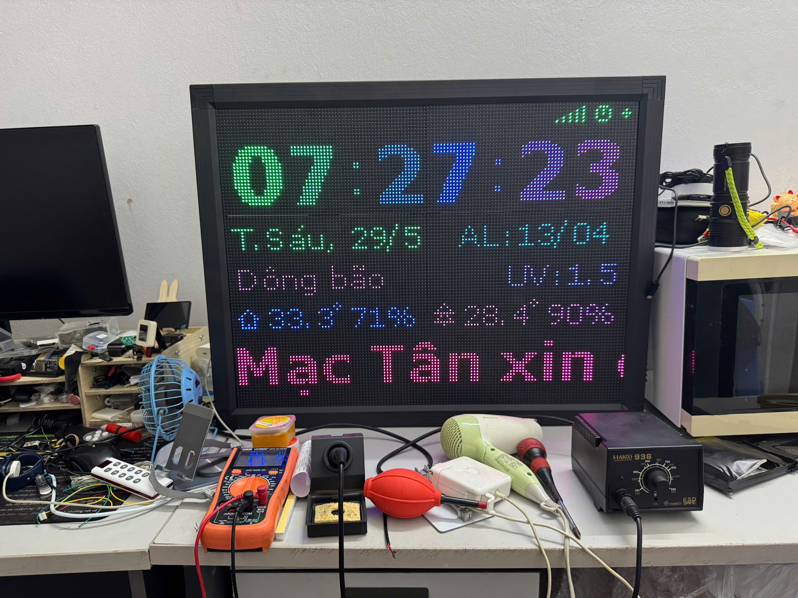
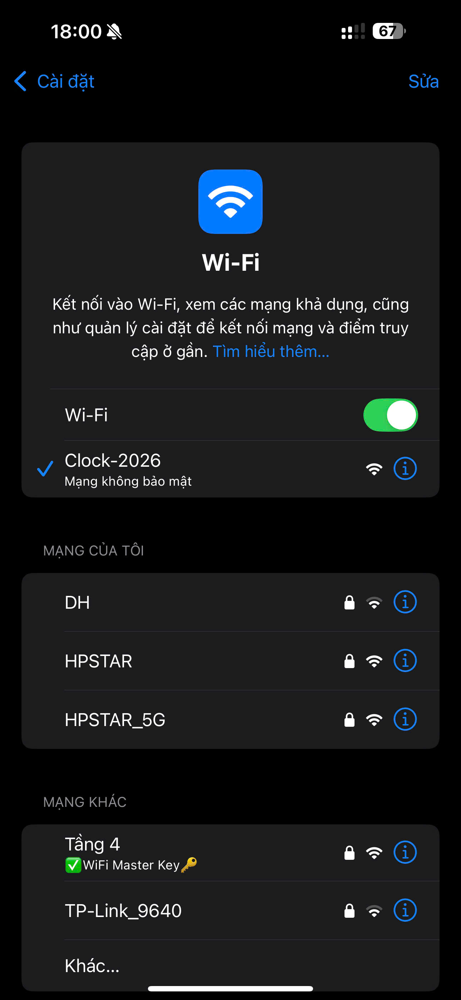
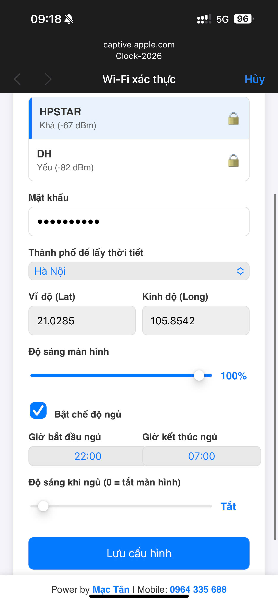

# ESP32 LED Matrix Clock

Đồng hồ LED Matrix P5 64x32 thông minh với ESP32, hiển thị thời gian, ngày tháng, âm lịch và thông tin thời tiết với hiệu ứng gradient đầy màu sắc.


## 🎬 Demo

Video demo trên tiktok:
[https://vt.tiktok.com/ZSaMTVyBm/
](https://vt.tiktok.com/ZSaMTVyBm/)

## ✨ Tính Năng

### 🕐 Hiển Thị Đồng Hồ

- **Giờ:Phút** với font chữ lớn (size 2) và hiệu ứng gradient rainbow
- **Giây** hiển thị ở góc phải với font nhỏ (size 1)
- Dấu hai chấm `:` với hiệu ứng chuyển động động (ping-pong animation)
- Tự động đồng bộ thời gian qua NTP (Network Time Protocol)
- Múi giờ GMT+7 (Việt Nam)

### 📅 Hiển Thị Ngày Tháng

Luân phiên hiển thị mỗi 5 giây:

1. **Thứ và Ngày/Tháng**: "Thứ 2, 18/01" hoặc "CNhật, 18/01"
2. **Thông Tin Thời Tiết**: "T 23.1°C H 79%" (nhiệt độ và độ ẩm)
3. **Âm Lịch**: "AL18/12/26" (ngày/tháng/năm âm lịch)

### 🌈 Hiệu Ứng Đồ Họa

- Gradient màu rainbow tự động chuyển đổi
- Hiệu ứng chuyển động mượt mà cho dấu hai chấm
- Màu sắc gradient riêng biệt cho từng ký tự
- Không nhấp nháy nhờ công nghệ DMA

### 🌤️ Thông Tin Thời Tiết

- Tự động lấy dữ liệu từ Open-Meteo API
- Hiển thị nhiệt độ (°C) và độ ẩm (%)
- Cập nhật mỗi 10 phút
- Dựa trên tọa độ GPS được cấu hình

### 📱 Cấu Hình Qua Web

- Giao diện web thân thiện để cấu hình WiFi
- Chọn thành phố từ danh sách có sẵn (Hà Nội, TP.HCM, Đà Nẵng, v.v.)
- Tự động điền tọa độ GPS khi chọn thành phố
- Lưu cấu hình vĩnh viễn vào NVS (Non-Volatile Storage)

### 🔄 Reset Về Chế Độ Cấu Hình

- Sử dụng nút **BOOT** có sẵn trên board ESP32 (GPIO 0)
- Nhấn một lần để xóa cấu hình và khởi động lại
- Tự động chuyển sang AP Mode để cấu hình lại

## ✅ Checklist Tính Năng Đã Hoàn Thành

### Hiển Thị (v1.0.x)

- [x] Hiển thị giờ:phút với font chữ lớn và hiệu ứng gradient rainbow
- [x] Hiển thị giây ở góc phải
- [x] Dấu hai chấm với hiệu ứng chuyển động (ping-pong animation)
- [x] Hiển thị thứ và ngày/tháng
- [x] Hiển thị thông tin thời tiết (nhiệt độ và độ ẩm)
- [x] Hiển thị âm lịch
- [x] Luân phiên hiển thị các thông tin mỗi 5 giây

### Kết Nối & Đồng Bộ (v1.0.x)

- [x] Tự động đồng bộ thời gian qua NTP
- [x] Kết nối WiFi với cấu hình đã lưu
- [x] Lấy dữ liệu thời tiết từ Open-Meteo API
- [x] Cập nhật thời tiết mỗi 10 phút

### Hiệu Ứng (v1.0.x)

- [x] Gradient màu rainbow tự động chuyển đổi
- [x] Hiệu ứng chuyển động mượt mà
- [x] Không nhấp nháy nhờ công nghệ DMA

### Cấu Hình (v2.0.0)

- [x] Chế độ AP Mode để cấu hình WiFi
- [x] Giao diện web thân thiện
- [x] Chọn thành phố từ danh sách có sẵn
- [x] Tự động điền tọa độ GPS khi chọn thành phố
- [x] Lưu cấu hình vào NVS (Non-Volatile Storage)
- [x] Nút reset phần cứng (nút BOOT)

### Cấu Hình Nâng Cao (v2.2.x)

- [x] **APSTA Mode**: Chạy đồng thời AP Mode (192.168.4.1) và STA Mode (kết nối WiFi nhà)
- [x] **Xác thực bảo mật**: Mật khẩu quản trị để truy cập cấu hình nâng cao
- [x] **Giao diện cấu hình nâng cao**: Web UI riêng cho STA mode với HTTP Basic Authentication

## 📋 TODO - Tính Năng Sắp Triển Khai

### Cải Thiện Kết Nối WiFi

- [x] **Retry Connect WiFi** (v2.0.x): Tự động thử kết nối lại WiFi khi mất kết nối hoặc kết nối thất bại, hiện tại phải nhấn phím reset để kết nối lại.
- [x] **WiFi Captive Portal** (v2.1.x): Tự động chuyển hướng đến trang cấu hình khi kết nối AP mode (không cần nhập địa chỉ IP thủ công)
- [x] **Danh sách WiFi** (v2.1.x): Hiển thị danh sách các mạng WiFi khả dụng trong trang web cấu hình để dễ dàng chọn

### Điều Chỉnh Hiển Thị

- [x] **Điều chỉnh độ sáng runtime** (v2.2.x): Cho phép thay đổi độ sáng LED Matrix qua giao diện web mà không cần upload lại code
  - Slider 0-255 với preview real-time
  - Áp dụng ngay lập tức, lưu vào NVS
- [x] **Chế độ ngủ thông minh** (v2.2.x):
  - Cấu hình giờ ngủ và giờ thức (ví dụ: 23:00 - 06:00)
  - Tùy chọn giảm độ sáng hoặc tắt hoàn toàn màn hình trong giờ ngủ
  - Tự động bật lại màn hình khi đến giờ thức
  - Hỗ trợ lịch qua đêm (cross-midnight)
- [ ] **Hiển thị ngày đặc biệt** (v2.3.x):
  - Hiển thị ngày lễ đặc biệt (như Tết, Giáng sinh, v.v.)
- [ ] **Hiển thị ngày tốt xấu** (v2.3.x):
  - Hiển thị ngày tốt xấu dựa trên ngày âm lịch
- [ ] **Hiển thị ngày sinh nhật** (v2.3.x):
  - Hiển thị ngày sinh nhật của bạn, bạn bè, nyc
- [ ] **Lưu trữ và hiển thị log** (v2.3.x):
  - Lưu trữ log vào database
  - Hiển thị log qua giao diện web các thông tin: nhiệt độ, độ ẩm của ngày nào đó đã lưu.

### Tích Hợp Module Âm Thanh

- [ ] **Hẹn giờ báo thức** (v2.3.x):
  - Cấu hình nhiều báo thức qua giao diện web
  - Chọn nhạc chuông báo thức
  - Tùy chọn lặp lại theo ngày trong tuần
  - Hiển thị biểu tượng báo thức trên màn hình LED
- [ ] **Loa Bluetooth** (v2.3.x):
  - Biến đồng hồ thành loa Bluetooth
  - Kết nối với điện thoại để phát nhạc
  - Hiển thị tên bài hát đang phát trên màn hình LED (nếu có metadata)
  - Điều khiển âm lượng qua giao diện web hoặc nút bấm

### Tích hợp module tuỳ chọn (có thể có hoặc không)

- [ ] **Module thời gian thực DS3231** (v2.4.x):
  - Giúp đồng hồ vẫn chạy đúng giờ khi mất kết nối internet
- [ ] **Cảm biến nhiệt độ, độ ẩm DHT22** (v2.4.x):
  - Hiển thị nhiệt độ, độ ẩm trong nhà (bằng module) và ngoài trời (bằng API - hiện tại)
- [ ] **Cảm biến chất lượng không khí BME680** (v2.4.x):
  - Hiển thị chất lượng không khí trên màn hình LED
- [ ] **Cảm biến ánh sáng BH1750** (v2.4.x):
  - Tự động điều chỉnh độ sáng LED Matrix theo ánh sáng môi trường
- [ ] **Module ESP-NOW** (v2.4.x):
  - Giao tiếp với các ESP32 khác để chia sẻ dữ liệu với các module khác.
- [ ] **Module radar** (v2.5.x):
  - Phát hiện chuyển động, người, vật thể đến gần để điều chỉnh độ sáng cho phù hợp.
- [ ] **Module GPS** (v2.5.x):
  - Lấy tọa độ GPS để hiển thị thời tiết hiện tại mà không cần phải config thủ công (điện thoại có thể được nhưng chỉ hỗ trợ web có SSL (HTTPS).
- [ ] **Làm MCP cho AI** (v3.x.x):
  - làm MCP cho AI (model context protocol)

### Tích hợp xiaozhi (dùng Esp32-s3)

- [ ] **Tích hợp xiaozhi** (v4.x.x):
  - Tích hợp xiaozhi vào esp32-s3 để làm chatbot âm thanh
  - Điều khiển thiết bị thông qua giọng nói

## 🛠️ Yêu Cầu Phần Cứng

Danh sách linh kiện - phần cứng sử dụng: [Google Sheet](https://docs.google.com/spreadsheets/d/1swM3OM9-xU4paUzBfFUdlDwbnLg4lPnLfiZTFbzTzyY/edit?usp=sharing)

### Linh Kiện Chính

- **ESP32 DevKit V1** (hoặc tương đương)
- **LED Matrix P5 64x32** (HUB75 interface)
- **Nguồn 5V/5A** (cho LED Matrix)

### Sơ Đồ Kết Nối LED Matrix

| HUB75 Pin | ESP32 GPIO | Chức Năng     |
| --------- | ---------- | ------------- |
| R1        | GPIO25     | Red Data 1    |
| G1        | GPIO26     | Green Data 1  |
| B1        | GPIO27     | Blue Data 1   |
| R2        | GPIO14     | Red Data 2    |
| G2        | GPIO12     | Green Data 2  |
| B2        | GPIO13     | Blue Data 2   |
| A         | GPIO23     | Address A     |
| B         | GPIO19     | Address B     |
| C         | GPIO5      | Address C     |
| D         | GPIO17     | Address D     |
| E         | GPIO18     | Address E     |
| CLK       | GPIO16     | Clock         |
| LAT       | GPIO4      | Latch         |
| OE        | GPIO15     | Output Enable |
| GND       | GND        | Ground        |

### Nút Reset

- Sử dụng nút **BOOT** có sẵn trên board ESP32 (GPIO 0)
- Nhấn một lần để reset về chế độ cấu hình

> [!CAUTION]
> **KHÔNG** cấp nguồn cho LED Matrix từ ESP32! LED Matrix cần nguồn 5V riêng biệt với dòng điện lớn (2-4A). ESP32 chỉ cung cấp tín hiệu điều khiển.

Chi tiết kết nối phần cứng: xem [LED_MATRIX_SETUP.md](LED_MATRIX_SETUP.md)

## 📦 Cài Đặt

### 1. Cài Đặt PlatformIO

#### Cách 1: PlatformIO CLI

```bash
# Cài đặt qua pip
pip install -U platformio

# Hoặc qua Homebrew (macOS)
brew install platformio
```

#### Cách 2: VS Code Extension

1. Mở VS Code
2. Vào Extensions (Ctrl+Shift+X)
3. Tìm "PlatformIO IDE"
4. Click Install

### 2. Clone Dự Án

```bash
git clone https://github.com/mvtcode/esp32-project.git
cd esp32-project
git checkout clock
```

### 3. Cài Đặt Dependencies

PlatformIO sẽ tự động tải các thư viện cần thiết khi build:

- ESP32-HUB75-MatrixPanel-DMA
- Adafruit GFX Library
- FastLED
- ArduinoJson
- ESPAsyncWebServer
- AsyncTCP

### 4. Build Project

```bash
pio run
```

### 5. Upload Code Lên ESP32

```bash
# Upload code chương trình
pio run --target upload

# Upload filesystem (SPIFFS) - chứa file index.html
pio run --target uploadfs
```

> [!TIP]
> Bạn cũng có thể sử dụng các script tiện lợi:
>
> ```bash
> ./upload.sh    # Upload code
> ./monitor.sh   # Mở Serial Monitor
> ```

### 6. Xem Serial Monitor

```bash
pio device monitor
```

## 🚀 Hướng Dẫn Sử Dụng

### Lần Đầu Sử Dụng (Chưa Có Cấu Hình)

1. **Upload code lên ESP32** (xem phần Cài Đặt)

2. **ESP32 tự động khởi động ở AP Mode**:
   - LED Matrix hiển thị:
     ```
     Conf wifi:    (màu cam, cố định)
     Clock-2026    (màu trắng, nháy)
     192.168.4.1   (màu cyan)
     ```

3. **Kết nối WiFi từ điện thoại/máy tính**:
   - Tên WiFi: `Clock-2026`
   - Không cần mật khẩu

   

4. **Mở trình duyệt và truy cập**:

   ```
   http://192.168.4.1
   ```

5. **Cấu hình trên giao diện web**:
   - Nhập **SSID** (tên WiFi nhà bạn)
   - Nhập **Mật khẩu WiFi**
   - Chọn **Thành phố** từ dropdown (tọa độ GPS sẽ tự động điền)
   - Click **"Lưu cấu hình"**

   

6. **ESP32 tự động khởi động lại**:
   - Kết nối WiFi đã cấu hình
   - Đồng bộ thời gian từ NTP
   - Lấy dữ liệu thời tiết
   - Hiển thị đồng hồ

### Sử Dụng Bình Thường

Sau khi đã cấu hình, ESP32 sẽ:

- Tự động kết nối WiFi khi khởi động
- Hiển thị đồng hồ với hiệu ứng gradient
- Luân phiên hiển thị: Ngày/Tháng → Thời tiết → Âm lịch (mỗi 5 giây)
- Tự động cập nhật thời tiết mỗi 10 phút

### Cấu Hình Nâng Cao (v2.2.x)

Sau khi setup xong, bạn có thể truy cập **giao diện cấu hình nâng cao** để điều chỉnh độ sáng và chế độ ngủ:

#### Cách truy cập:

1. **Tìm địa chỉ IP của ESP32**:
   - Xem trong Serial Monitor: `STA Mode: http://192.168.1.xxx/`
   - Hoặc vào router để xem IP của thiết bị "ESP32"
   - Hoặc truy cập: `http://192.168.4.1/` (AP Mode luôn hoạt động)

2. **Mở trình duyệt và truy cập**:

   ```
   http://<IP-của-ESP32>/
   ```

3. **Đăng nhập**:
   - Username: `admin`
   - Password: Mật khẩu quản trị bạn đã nhập lúc setup

4. **Giao diện cấu hình nâng cao** sẽ hiển thị với các tùy chọn:

#### Điều chỉnh độ sáng:

- Kéo **slider độ sáng** từ 0-255
- Giá trị hiện tại hiển thị real-time
- Click **"Áp dụng ngay"** → LED Matrix thay đổi độ sáng ngay lập tức
- Cấu hình được lưu vào NVS, giữ nguyên sau khi khởi động lại

#### Chế độ ngủ thông minh:

1. **Bật chế độ ngủ**: Tick vào checkbox "Bật chế độ ngủ tự động"

2. **Cấu hình lịch ngủ**:
   - **Giờ bắt đầu ngủ**: Ví dụ `23:00`
   - **Giờ thức dậy**: Ví dụ `06:00`
   - **Độ sáng khi ngủ**: Chọn từ dropdown
     - `Tắt hẳn` (0)
     - `Rất tối` (10)
     - `Tối` (30)
     - `Vừa phải` (50)

3. **Lưu cấu hình**: Click "Lưu cấu hình ngủ"

4. **Hoạt động**:
   - Đồng hồ tự động kiểm tra mỗi phút
   - Khi đến giờ ngủ → Giảm độ sáng hoặc tắt màn hình
   - Khi đến giờ thức → Bật lại độ sáng bình thường
   - Hỗ trợ lịch qua đêm (ví dụ: 23:00 → 06:00)

> [!TIP]
> **APSTA Mode**: ESP32 chạy đồng thời cả AP Mode (192.168.4.1) và STA Mode (kết nối WiFi nhà). Bạn có thể truy cập cấu hình từ cả 2 địa chỉ IP!

### Reset Về Chế Độ Cấu Hình

Nếu bạn muốn đổi WiFi hoặc cấu hình lại:

1. **Nhấn nút BOOT** trên board ESP32 (GPIO 0)
2. ESP32 sẽ:
   - Xóa toàn bộ cấu hình đã lưu
   - Khởi động lại
   - Tự động chuyển sang AP Mode
3. Làm lại các bước cấu hình như lần đầu

> [!NOTE]
> Nút BOOT là nút có sẵn trên board ESP32, thường được dùng để upload code. Nhấn một lần là đủ để kích hoạt reset.

## 📂 Cấu Trúc Dự Án

```
esp32-project/
├── platformio.ini           # Cấu hình PlatformIO
├── README.md                # File này
├── LED_MATRIX_SETUP.md      # Hướng dẫn kết nối phần cứng chi tiết
├── data/                    # Filesystem (SPIFFS)
│   └── index.html           # Giao diện web cấu hình
├── src/                     # Source code
│   ├── main.cpp             # Code chính
│   ├── config_manager.cpp   # Quản lý cấu hình NVS
│   ├── config_manager.h
│   ├── web_server.cpp       # Web server cho AP mode
│   ├── web_server.h
│   ├── reset_button.cpp     # Xử lý nút reset
│   ├── reset_button.h
│   ├── lunar_calendar.cpp   # Tính toán âm lịch
│   └── lunar_calendar.h
├── upload.sh                # Script upload code
└── monitor.sh               # Script mở serial monitor
```

## 🎨 Tùy Chỉnh

### Thay Đổi Độ Sáng

Trong `src/main.cpp`, dòng 206:

```cpp
dma_display->setBrightness8(100); // 0-255
```

### Thay Đổi Tốc Độ Gradient

Trong `src/main.cpp`, dòng 563:

```cpp
globalHue += 1; // Tăng giá trị này để gradient chạy nhanh hơn
```

### Thêm Thành Phố Mới

Trong `data/index.html`, thêm vào mảng `cities`:

```javascript
const cities = [
  { name: "Hà Nội", lat: 21.0285, lon: 105.8542 },
  { name: "Thành phố mới", lat: xx.xxxx, lon: xxx.xxxx },
  // ...
];
```

## 🔌 API Endpoints (v2.2.x)

ESP32 cung cấp các REST API endpoints để tích hợp với hệ thống khác:

### Public Endpoints (không cần xác thực)

#### `GET /api/wifi`

Quét và trả về danh sách WiFi khả dụng

**Response:**

```json
{
  "networks": [
    {
      "ssid": "MyWiFi",
      "rssi": -45,
      "encryption": "ENCRYPTED"
    }
  ]
}
```

#### `POST /api/save`

Lưu cấu hình ban đầu (chỉ dùng trong AP Mode)

**Request:**

```json
{
  "ssid": "MyWiFi",
  "password": "mypassword",
  "adminPassword": "admin123",
  "latitude": 21.0285,
  "longitude": 105.8542
}
```

**Response:**

```json
{
  "status": "success"
}
```

### Protected Endpoints (cần HTTP Basic Auth)

> Username: `admin` | Password: Mật khẩu quản trị đã setup

#### `GET /api/config`

Lấy cấu hình hiện tại

**Response:**

```json
{
  "ssid": "MyWiFi",
  "latitude": 21.0285,
  "longitude": 105.8542,
  "brightness": 100,
  "sleepEnabled": true,
  "sleepHour": 23,
  "sleepMinute": 0,
  "wakeHour": 6,
  "wakeMinute": 0,
  "sleepBrightness": 10
}
```

#### `POST /api/brightness`

Cập nhật độ sáng

**Request:**

```json
{
  "brightness": 150
}
```

**Response:**

```json
{
  "status": "success"
}
```

#### `POST /api/sleep`

Cập nhật cấu hình chế độ ngủ

**Request:**

```json
{
  "sleepEnabled": true,
  "sleepHour": 23,
  "sleepMinute": 0,
  "wakeHour": 6,
  "wakeMinute": 0,
  "sleepBrightness": 10
}
```

**Response:**

```json
{
  "status": "success"
}
```

#### `POST /api/admin-password`

Thay đổi mật khẩu quản trị

**Request:**

```json
{
  "newPassword": "newpassword123"
}
```

**Response:**

```json
{
  "status": "success"
}
```

### Ví dụ sử dụng với curl:

```bash
# Lấy cấu hình
curl -u admin:yourpassword http://192.168.1.100/api/config

# Thay đổi độ sáng
curl -u admin:yourpassword -X POST \
  -H "Content-Type: application/json" \
  -d '{"brightness":200}' \
  http://192.168.1.100/api/brightness

# Bật chế độ ngủ
curl -u admin:yourpassword -X POST \
  -H "Content-Type: application/json" \
  -d '{"sleepEnabled":true,"sleepHour":23,"sleepMinute":0,"wakeHour":6,"wakeMinute":0,"sleepBrightness":10}' \
  http://192.168.1.100/api/sleep
```

### Thay Đổi Tên WiFi AP Mode

Trong `src/web_server.cpp`, tìm dòng:

```cpp
WiFi.softAP("Clock-2026");
```

### Thay Đổi Thời Gian Cập Nhật Thời Tiết

Trong `src/main.cpp`, dòng 28:

```cpp
const unsigned long weatherUpdateInterval = 600000; // 10 phút (ms)
```

## 🔧 Troubleshooting

### LED Matrix không sáng

- ✅ Kiểm tra nguồn 5V cho LED Matrix
- ✅ Kiểm tra kết nối GND chung giữa ESP32 và LED Matrix
- ✅ Kiểm tra cáp HUB75 cắm đúng hướng

### Màu sắc hiển thị sai

- ✅ Kiểm tra kết nối R1, G1, B1, R2, G2, B2
- ✅ Thử thay đổi driver IC trong code (một số panel dùng FM6126A)

### Không kết nối được WiFi AP Mode

- ✅ Đảm bảo đã upload cả code và filesystem (`uploadfs`)
- ✅ Kiểm tra Serial Monitor xem có thông báo lỗi
- ✅ Reset ESP32 và thử lại

### Không lưu được cấu hình

- ✅ Kiểm tra kết nối mạng từ điện thoại đến ESP32
- ✅ Xem Serial Monitor để debug
- ✅ Đảm bảo đã nhập đúng SSID và password

### Thời gian không chính xác

- ✅ Kiểm tra kết nối WiFi
- ✅ Đảm bảo ESP32 có thể truy cập internet để đồng bộ NTP
- ✅ Kiểm tra múi giờ (GMT+7 cho Việt Nam)

### Nút Reset không hoạt động

- ✅ Sử dụng nút BOOT có sẵn trên board ESP32 (không cần nút ngoài)
- ✅ Nhấn một lần rõ ràng (có debounce 1 giây)
- ✅ Xem Serial Monitor để kiểm tra log reset

## 📝 Lịch Sử Phiên Bản

### v2.0.0 (2026-01-18)

- ✨ Thêm chế độ AP Mode để cấu hình WiFi qua web
- ✨ Thêm hiển thị thông tin thời tiết
- ✨ Thêm hiển thị âm lịch
- ✨ Thêm nút reset phần cứng
- ✨ Lưu cấu hình vào NVS
- 🎨 Cải thiện hiệu ứng gradient
- 🎨 Thêm hiệu ứng chuyển động cho dấu hai chấm
- 🐛 Sửa lỗi hiển thị chữ "CNhật" với ký tự đặc biệt

### v2.0.0

- 🎉 Phiên bản đầu tiên với chức năng đồng hồ cơ bản

## 🤝 Đóng Góp

Mọi đóng góp đều được chào đón! Hãy tạo Pull Request hoặc mở Issue nếu bạn có ý tưởng cải thiện.

## 📄 License

MIT License - Tự do sử dụng và chỉnh sửa cho mục đích cá nhân và thương mại.

## 👨‍💻 Tác Giả

**Power by [Mạc Tân](https://www.facebook.com/mvt.hp.star/)** | Mobile: [0964 335 688](tel:0964335688)

---

⭐ Nếu dự án này hữu ích, hãy cho một star trên GitHub!
