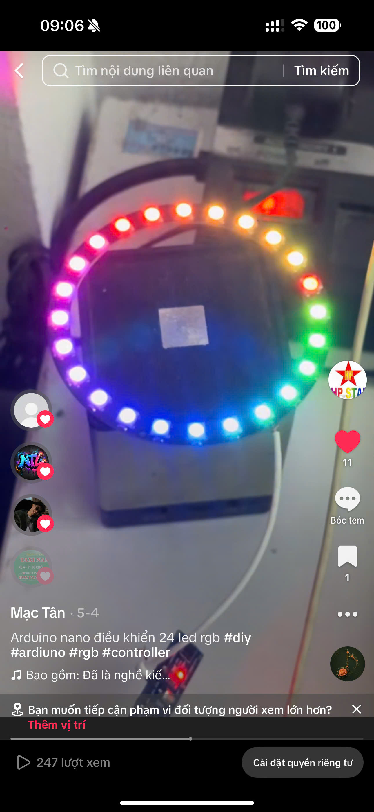

# Dự án Điều khiển LED WS2812 với Arduino Nano

Dự án này sử dụng Arduino Nano để điều khiển 24 LED RGB WS2812 với hiệu ứng cầu vồng (Rainbow) mượt mà.

Video demo: [https://vt.tiktok.com/ZSXNLoofk/
](https://vt.tiktok.com/ZSXNLoofk/)

## Yêu cầu Phần cứng

- **Board**: [Arduino Nano (ATmega328P)](https://s.shopee.vn/AUsLLfVgt3)
- **LED**: [24 LED RGB chip WS2812 (Vòng LED hoặc Dây LED)](https://s.shopee.vn/7AbtNOcjdl)
- **Kết nối**:
  - **VCC**: Nối với nguồn 5V.
  - **GND**: Nối với GND.
  - **Data (DI)**: Nối với chân **D6** của Arduino Nano.

## Cài đặt và Sử dụng

Dự án sử dụng **PlatformIO CLI** hoặc **VS Code Extension**.

### Các lệnh cơ bản

1.  **Build dự án**:

    ```bash
    pio run
    ```

2.  **Upload code lên Arduino Nano**:

    ```bash
    pio run --target upload
    ```

    _(Mặc định đã được cấu hình chọn môi trường `nano`)_

3.  **Mở Serial Monitor**:
    ```bash
    pio device monitor
    ```

## Cấu hình Dự án (platformio.ini)

File `platformio.ini` đã được cấu hình sẵn:

- **Default Env**: `nano`
- **Thư viện**: `FastLED` (phiên bản ^3.6.0)
- **Độ sáng mặc định**: 40% (102/255) - Có thể điều chỉnh trong `src/main.cpp`.

## Cấu trúc thư mục

- `src/main.cpp`: Chứa mã nguồn chính điều khiển LED.
- `platformio.ini`: File cấu hình môi trường và thư viện.

## Troubleshooting

- **Lỗi Upload**: Kiểm tra cáp USB và đảm bảo bạn đã chọn đúng cổng Serial (nếu cần chỉ định thủ công trong `platformio.ini` bằng `upload_port`).
- **LED không sáng**: Kiểm tra lại dây Data (DI) đã nối đúng chân D6 chưa và nguồn cấp đã đủ 5V chưa.
- **Màu sắc không đúng**: Có thể cần điều chỉnh `COLOR_ORDER` trong `src/main.cpp` (mặc định là `GRB`).

## 👨‍💻 Tác Giả

**Power by [Mạc Tân](https://www.facebook.com/mvt.hp.star/)** | Mobile: [0964 335 688](tel:0964335688)

---

⭐ Nếu dự án này hữu ích, hãy cho một star trên GitHub!

