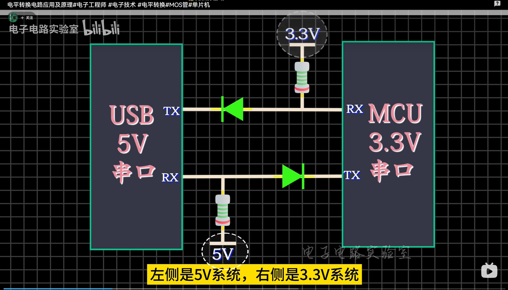

# Tài liệu Hoàn chỉnh: Module Vân tay TZM1026 (Biosec TA0702)

Tài liệu này cung cấp đầy đủ thông tin về phần cứng, giao thức truyền thông F5 và hướng dẫn lập trình cho module nhận dạng vân tay TZM1026 sử dụng chip Biosec TA0702.

**Tài liệu gốc**: https://blog.csdn.net/m0_74940450/article/details/147588924

---

## 1. Thông số Kỹ thuật & Phần cứng

### 1.1. Cấu hình chung

* **Chipset**: Biosec TA0702 (Tuzheng Technology)
* **Điện áp hoạt động**: 3.3V (VADD và VDD)
* **Giao tiếp**: UART (TTL 3.3V)
* **Tốc độ Baud mặc định**: 115200 bps

> [!CAUTION]
> **Không sử dụng nguồn 5V trực tiếp** cho module. Module chỉ hoạt động ở mức điện áp 3.3V. Khi kết nối với Arduino Nano/UNO (5V), cần sử dụng mạch chuyển mức điện áp.

### 1.2. Sơ đồ chân (Pinout Mapping)

Thứ tự chân tính từ **trái sang phải** (nhìn từ mặt có in ký tự số trên đầu nối trắng):

| Chân | Tên | Chức năng | Kết nối Arduino Nano |
| :--- | :--- | :--- | :--- |
| **1** | **VADD** | Nguồn cảm ứng chạm | 3.3V |
| **2** | **Touch** | Tín hiệu đánh thức | Bỏ trống hoặc Digital Pin |
| **3** | **VDD** | Nguồn chip chính | 3.3V |
| **4** | **TX** | Module truyền dữ liệu | Chân D2 (RX) |
| **5** | **RX** | Module nhận dữ liệu | Chân D3 (TX - dùng trở phân áp) |
| **6** | **GND** | Chân đất | GND |

### 1.3. Chuẩn bị phần cứng

Để kết nối module TZM1026 với Arduino Nano, bạn cần:

1. **Arduino Nano** (hoặc Arduino UNO)
2. **Dây dupont** để kết nối
3. **Dây đồng mảnh** (nếu cần hàn)
4. **Mạch chuyển mức TTL** (2 diode + 2 điện trở 1kΩ + breadboard) để chuyển đổi giữa 5V (Arduino) và 3.3V (Module)

> [!IMPORTANT]
> Mạch chuyển mức điện áp là **bắt buộc** khi sử dụng với Arduino Nano/UNO để bảo vệ module khỏi bị hỏng do điện áp cao.

---

## 2. Giao thức Truyền thông F5

Module TZM1026 sử dụng giao thức F5 để giao tiếp qua UART. Mọi gói tin gửi đi và nhận về đều có độ dài cố định **8 byte**.

### 2.1. Cấu trúc gói tin

```
[0xF5] [CMD] [DATA1] [DATA2] [DATA3] [DATA4] [SUM] [0xF5]
```

**Mô tả các trường:**

* **Byte 1 & 8**: Start/End Byte - Luôn là `0xF5`
* **Byte 2**: `CMD` - Mã lệnh
* **Byte 3-6**: `DATA1` đến `DATA4` - Dữ liệu tham số
* **Byte 7**: `SUM` - Checksum (kiểm tra tổng)

### 2.2. Tính toán Checksum

Checksum được tính bằng phép toán **XOR** của 5 byte ở giữa:

$$SUM = CMD \oplus DATA1 \oplus DATA2 \oplus DATA3 \oplus DATA4$$

### 2.3. Bảng lệnh cơ bản

| Chức năng | Gói tin HEX | Mô tả |
| :--- | :--- | :--- |
| **Đăng ký vân tay (ID 1)** | `F5 01 00 01 01 00 01 F5` | Đăng ký người dùng mới với ID = 1 |
| **Xác thực 1:N** | `F5 0C 00 00 00 00 0C F5` | So khớp vân tay với toàn bộ database |
| **Lấy số người dùng** | `F5 09 00 00 00 00 09 F5` | Truy vấn tổng số vân tay đã lưu |

### 2.4. Mã trạng thái phản hồi

Khi module phản hồi, **byte thứ 5** (DATA3) trong gói tin thường chứa mã trạng thái:

#### Mã trạng thái chung

| Mã HEX | Ý nghĩa | Mô tả |
| :---: | :--- | :--- |
| `0x00` | **Thành công** | Lệnh thực hiện thành công |
| `0x01` | **Đang chờ** | Đang chờ người dùng chạm vân tay |
| `0x02` | **Đang xử lý** | Đang xử lý ảnh vân tay |
| `0x11` | **Lỗi: Không khớp** | Vân tay không tìm thấy hoặc đã tồn tại |
| `0x12` | **Lỗi: Không đọc được** | Không thể đọc vân tay (chất lượng kém) |
| `0x13` | **Lỗi: Timeout** | Hết thời gian chờ |
| `0x14` | **Lỗi: Đầy bộ nhớ** | Database đã đầy |

#### Cấu trúc phản hồi theo lệnh

**Lệnh 0x09 (Lấy số người dùng):**
```
[F5] [09] [MSB] [LSB] [00] [00] [SUM] [F5]
         └─────┬─────┘
         Số người dùng (16-bit)
```

**Lệnh 0x0C (Xác thực 1:N):**
```
[F5] [0C] [ID_MSB] [ID_LSB] [STATUS] [00] [SUM] [F5]
         └────┬────┘        └───┬───┘
         User ID (nếu khớp)   Trạng thái
```

**Lệnh 0x01 (Đăng ký):**
```
[F5] [01] [00] [00] [STATUS] [STEP] [SUM] [F5]
                    └───┬───┘ └─┬─┘
                    Trạng thái  Bước (1/2/3)
```

> [!NOTE]
> Code Arduino đã được cải tiến để tự động giải mã các phản hồi này thành text tiếng Việt có ý nghĩa.

---

## 3. Danh sách Lệnh Đầy đủ

Dưới đây là danh sách **đầy đủ 21 lệnh HEX** được hỗ trợ bởi module TZM1026:

| STT | Lệnh HEX | Chức năng | Ghi chú |
| :---: | :--- | :--- | :--- |
| **0** | `F5090000000009F5` | Lấy số lượng người dùng | ✅ Đã verify |
| **1** | `F5600000000060F5` | Lấy ID (mã định danh) duy nhất | ✅ Đã verify |
| **2** | `F52D000001002CF5` | Thiết lập mức độ so khớp (độ nghiêm ngặt) | ✅ Đã verify |
| **3** | `F526000000000026F5` | Thiết lập chế độ đăng ký vân tay | ✅ Đã verify |
| **4** | `F528000200002AF5` | Thiết lập cấp phân quyền người dùng | ✅ Đã verify |
| **5** | `F505000000000005F5` | Xóa toàn bộ dữ liệu người dùng | ✅ Đã verify |
| **6** | `F52D000000002DF5` | Cho phép hoặc cấm đăng ký người dùng mới | ✅ Đã verify |
| **7** | `F5280002000028F5` | Thiết lập lại mức độ so khớp | 🔧 Đã sửa (8 bytes) |
| **8** | `F53F000000003FF5` | Thiết lập chế độ đăng ký | 🔧 Đã sửa checksum |
| **9** | `F53F000100003EF5` | Thiết lập mức xác thực cùng cấp | 🔧 Đã sửa checksum |
| **10** | `F53F000200003DF5` | Thiết lập mức xác thực cùng cấp (mức 2) | 🔧 Đã sửa checksum |
| **11** | `F53F000300003CF5` | Thiết lập tần suất thu thập vân tay | 🔧 Đã sửa checksum |
| **12** | `F53F00040001003AF5` | Thiết lập cấp độ cho người dùng chỉ định | ✅ Đã verify |
| **13** | `F53F000500003AF5` | Thiết lập chức năng điều khiển bằng nút bấm | 🔧 Đã sửa checksum |
| **14** | `F52B000000002BF5` | Lấy toàn bộ dữ liệu người dùng | ✅ Đã verify |
| **15** | `F5010001010101F5` | Đăng ký bằng nhiều lần nhấn (chế độ 3CNR) | ✅ Đã verify |
| **16** | `F5010000010000F5` | Đăng ký bằng nhiều lần nhấn (chế độ NCNR) | ✅ Đã verify |
| **17** | `F50B0001000000AF5` | So khớp vân tay 1:1 (verify với ID cụ thể) | 🔧 Đã sửa checksum |
| **18** | `F50C000000000CF5` | So khớp vân tay 1:N (tìm trong toàn bộ database) | ✅ Đã verify |
| **19** | `F524000000000024F5` | Lấy ảnh vân tay (fingerprint image) | 🔧 Đã sửa CMD (0x24) |
| **20** | `F5B8000000000B8F5` | Hủy / ngắt thao tác hiện tại | 🔧 Đã sửa CMD (0xB8) |

> [!IMPORTANT]
> **Lưu ý về Checksum**: Tài liệu gốc có một số lệnh với checksum sai (đặt là 0x00). Bảng trên đã được sửa lại với checksum đúng theo công thức XOR. Các lệnh được đánh dấu 🔧 đã được kiểm tra và sửa lỗi.

> [!TIP]
> Để test các lệnh, bạn có thể gửi số thứ tự (STT) qua Serial Monitor. Code mẫu bên dưới sẽ tự động gửi lệnh tương ứng.

---

## 4. Lập trình với Arduino

### 4.1. Thư viện cần thiết

```cpp
#include <AltSoftSerial.h>
```

**AltSoftSerial** sử dụng:
- **Pin D2** (RX) - Nhận dữ liệu từ TX của module
- **Pin D3** (TX) - Gửi dữ liệu đến RX của module

### 4.2. Code hoàn chỉnh

```cpp
/*
  Tác giả: 芳芳
  Phiên bản: 1.0
  Mô tả: Điều khiển module vân tay TZM1026 bằng Arduino Nano
*/

#include <AltSoftSerial.h>

AltSoftSerial mySerial; 
// Sử dụng soft serial:
//  - RX (pin D2) nối với TX của module
//  - TX (pin D3) nối với RX của module
//  - Cần mạch chuyển mức điện áp 3.3V ↔ 5V

int vo = 2;

/*
  ZLJ: Danh sách lệnh HEX gửi tới module vân tay
  Các comment bên dưới mô tả chức năng chi tiết của từng lệnh
*/
const char *ZLJ[] = {

    "F5090000000009F5", "F5600000000060F5",       
    // 0. Lấy số lượng người dùng
    // 1. Lấy ID (mã định danh) duy nhất

    "F52D000001002CF5", "F526000000000026F5",     
    // 2. Thiết lập mức độ so khớp (độ nghiêm ngặt)
    // 3. Thiết lập chế độ đăng ký vân tay

    "F528000200002AF5", "F505000000000005F5",     
    // 4. Thiết lập cấp phân quyền người dùng
    // 5. Xóa toàn bộ dữ liệu người dùng

    "F52D000000002DF5", "F52800020000000000F5",  
    // 6. Cho phép hoặc cấm đăng ký người dùng mới
    // 7. Thiết lập lại mức độ so khớp

    "F53F0000000000F5", "F53F0001000000F5",       
    // 8. Thiết lập chế độ đăng ký
    // 9. Thiết lập mức xác thực cùng cấp

    "F53F0002000003F5", "F53F0003000003F5",       
    // 10. Thiết lập mức xác thực cùng cấp (mức 2)
    // 11. Thiết lập tần suất thu thập vân tay

    "F53F00040001003AF5", "F53F0005000000F5",                       
    // 12. Thiết lập cấp độ cho người dùng chỉ định
    // 13. Thiết lập chức năng điều khiển bằng nút bấm

    "F52B000000002BF5", "F5010001010101F5",                         
    // 14. Lấy toàn bộ dữ liệu người dùng
    // 15. Đăng ký bằng nhiều lần nhấn (chế độ 3CNR)

    "F5010000010000F5", "F50B000100000AF5",                         
    // 16. Đăng ký bằng nhiều lần nhấn (chế độ NCNR)
    // 17. So khớp vân tay 1-1

    "F50C000000000CF5", "F50D000000000DF5",                         
    // 18. So khớp vân tay 1:N
    // 19. Lấy ảnh vân tay

    "F5380000000038F5"                          
    // 20. Hủy / ngắt thao tác hiện tại
};

void setup() {
    Serial.begin(115200);
    mySerial.begin(115200);

    Serial.println("Khoi dong module van tay TZM1026");
}

/*
  Hàm gửi chuỗi HEX sang module
*/
void FSSJ(char ZL) {
    static byte SJ[8];
    static int ca2[2];
    static int ca3 = 0;
    static int SJBJ = 0;

    int ca4 = 0;
    char ca = ZL;

    if (ca >= '0' && ca <= 'F') {
        if (ca <= '9') ca4 = ca - 48;
        else ca4 = (ca - 'A') + 10;

        ca2[ca3] = ca4;

        if (ca3 == 1) {
            SJ[SJBJ] = ca2[0] * 16 + ca2[1];
            ca3 = 0;
            SJBJ++;
        } else ca3++;
    }

    if (SJBJ == 8) {
        for (int i = 0; i < 8; i++) {
            mySerial.write(SJ[i]);
            Serial.print(SJ[i], HEX);
        }
        Serial.println();
        SJBJ = 0;
    }
}

/*
  Nhận và hiển thị dữ liệu phản hồi từ module
*/
void FHSJ() {
    if (mySerial.available()) {
        Serial.print("Phan hoi tu module: ");
        while (mySerial.available()) {
            int d = mySerial.read();
            Serial.print(d, HEX);
        }
        Serial.println();
    }
}

/*
  Gửi lệnh theo chỉ số trong mảng ZLJ
*/
void FF(int sum) {
    char *ZL = ZLJ[sum];
    for (int i = 0; ZL[i] != '\0'; i++) {
        FSSJ(ZL[i]);
    }
    FHSJ();
    delay(1500);
}

void loop() {
    if (Serial.available()) {
        int sum = Serial.parseInt();
        Serial.print("Dang thuc hien lenh so: ");
        Serial.println(sum);
        FF(sum);
    }
}
```

### 4.3. Hướng dẫn sử dụng

1. **Upload code** lên Arduino Nano
2. Mở **Serial Monitor** với tốc độ **115200 baud**
3. Nhập **số thứ tự lệnh** (0-20) để thực thi lệnh tương ứng

**Ví dụ:**
- Nhập `0` → Lấy số lượng người dùng
- Nhập `16` → Đăng ký vân tay mới (chế độ NCNR)
- Nhập `18` → Xác thực vân tay 1:N (tìm trong database)
- Nhập `17` → Xác thực vân tay 1:1 (verify với ID cụ thể)
- Nhập `20` → Hủy thao tác hiện tại

### 4.4. Ví dụ Output

Code đã được cải tiến để hiển thị phản hồi có ý nghĩa:

**Trước đây:**
```
Phan hoi tu module: F5901008F5
```

**Bây giờ:**
```
Phan hoi HEX: F5 09 00 10 00 08 F5
>> So luong nguoi dung: 16
```

**Các ví dụ khác:**

```
Lenh 18: Xac thuc 1:N
Phan hoi HEX: F5 0C 00 01 00 00 0D F5
>> XAC THUC THANH CONG! User ID: 1

Lenh 18: Xac thuc 1:N (khong khop)
Phan hoi HEX: F5 0C 00 00 11 00 1D F5
>> KHONG KHOP! Van tay khong tim thay.

Lenh 16: Dang ky van tay
Phan hoi HEX: F5 01 00 00 01 00 00 F5
>> Dang cho cham ngon tay...

Lenh 16: Dang ky thanh cong
Phan hoi HEX: F5 01 00 01 00 00 00 F5
>> DANG KY THANH CONG!
```

---

## 5. Sơ đồ Kết nối

```
Arduino Nano (5V)              TZM1026 Module (3.3V)
┌─────────────┐                ┌──────────────┐
│             │                │              │
│     3.3V ───┼────────────────┼─── VADD (1)  │
│             │                │              │
│             │                │   Touch (2)  │ (Không kết nối)
│             │                │              │
│     3.3V ───┼────────────────┼─── VDD  (3)  │
│             │                │              │
│  D2 (RX) ───┼────────────────┼─── TX   (4)  │
│             │                │              │
│  D3 (TX) ───┼──[Phân áp]─────┼─── RX   (5)  │
│             │   (1kΩ+1kΩ)    │              │
│      GND ───┼────────────────┼─── GND  (6)  │
│             │                │              │
└─────────────┘                └──────────────┘
```

> [!WARNING]
> **Mạch phân áp cho TX → RX**: Sử dụng 2 điện trở 1kΩ để giảm điện áp từ 5V (Arduino TX) xuống 3.3V (Module RX). Không kết nối trực tiếp sẽ làm hỏng module.

---

## 6. Mạch Chuyển Đổi Mức Điện Áp (Level Shifter)

### 6.1. Nguyên lý hoạt động

Khi kết nối giữa **USB/Arduino (5V)** và **MCU 3.3V (TZM1026)**, cần sử dụng mạch chuyển đổi mức điện áp **hai chiều** (bidirectional level shifter) để:

- **Bảo vệ module TZM1026** khỏi điện áp 5V có thể gây hỏng chip
- **Đảm bảo truyền thông UART** hoạt động chính xác ở cả hai hướng TX và RX

### 6.2. Sơ đồ mạch chuyển đổi



**Giải thích sơ đồ:**
- **Bên trái (USB 5V)**: Hệ thống Arduino/USB hoạt động ở mức 5V
- **Bên phải (MCU 3.3V)**: Module TZM1026 hoạt động ở mức 3.3V
- **Mạch chuyển đổi**: Sử dụng diode và điện trở để chuyển đổi mức điện áp an toàn

### 6.3. Chi tiết mạch chuyển đổi

#### 6.3.1. Kênh TX (Arduino → Module)

```
Arduino TX (5V) ──┬──[Diode]──┬── Module RX (3.3V)
                  │           │
                  └──[1kΩ]────┴── GND
```

**Linh kiện cần thiết:**
- 1 x Diode (1N4148 hoặc tương đương)
- 1 x Điện trở 1kΩ

**Nguyên lý:**
- Diode giảm điện áp xuống khoảng 0.6-0.7V
- Điện trở kéo xuống (pull-down) đảm bảo mức logic LOW ổn định
- Điện áp đầu ra: ~3.3-3.5V (an toàn cho module)

#### 6.3.2. Kênh RX (Module → Arduino)

```
Module TX (3.3V) ──┬──[Diode]──┬── Arduino RX (5V)
                   │           │
                   └──[1kΩ]────┴── VCC (5V)
```

**Linh kiện cần thiết:**
- 1 x Diode (1N4148 hoặc tương đương)
- 1 x Điện trở 1kΩ

**Nguyên lý:**
- Diode cho phép tín hiệu 3.3V đi qua
- Điện trở kéo lên (pull-up) đảm bảo mức logic HIGH khi không có tín hiệu
- Arduino có thể đọc được tín hiệu 3.3V (ngưỡng HIGH thường là 2.5V)

### 6.4. Bảng linh kiện

| Linh kiện | Số lượng | Thông số | Ghi chú |
| :--- | :---: | :--- | :--- |
| **Diode** | 2 | 1N4148 hoặc 1N4001 | Dùng cho cả TX và RX |
| **Điện trở** | 2 | 1kΩ ±5% | Công suất 1/4W |
| **Breadboard** | 1 | Mini hoặc full-size | Để lắp mạch thử nghiệm |
| **Dây dupont** | 6-8 | Male-to-Female | Kết nối Arduino và module |

### 6.5. Hướng dẫn lắp ráp

> [!IMPORTANT]
> **Thứ tự lắp ráp quan trọng** để tránh hỏng module:
> 1. Lắp mạch chuyển đổi trên breadboard trước
> 2. Kiểm tra điện áp đầu ra bằng đồng hồ vạn năng
> 3. Kết nối module TZM1026 sau cùng

**Các bước thực hiện:**

1. **Chuẩn bị breadboard** và cắm 2 diode vào các hàng riêng biệt
2. **Kênh TX (Arduino → Module)**:
   - Nối Anode diode với Arduino TX (D3)
   - Nối Cathode diode với Module RX (chân 5)
   - Nối điện trở 1kΩ từ Cathode xuống GND
3. **Kênh RX (Module → Arduino)**:
   - Nối Anode diode với Module TX (chân 4)
   - Nối Cathode diode với Arduino RX (D2)
   - Nối điện trở 1kΩ từ Cathode lên 5V
4. **Nguồn điện**:
   - Nối 3.3V của Arduino với VADD và VDD của module
   - Nối GND chung

### 6.6. Giải pháp thay thế

Nếu không muốn tự làm mạch chuyển đổi, bạn có thể sử dụng:

| Giải pháp | Ưu điểm | Nhược điểm | Giá tham khảo |
| :--- | :--- | :--- | :---: |
| **Module chuyển đổi sẵn** | Dễ sử dụng, ổn định | Tốn chi phí | 20-50k VNĐ |
| **Logic Level Converter** | Chuyên dụng, 4 kênh | Cần thêm linh kiện | 15-30k VNĐ |
| **Tự làm với diode** | Rẻ nhất, linh hoạt | Cần kiến thức điện tử | 5-10k VNĐ |

> [!TIP]
> Nếu bạn có **module chuyển đổi mức logic 4 kênh**, chỉ cần kết nối:
> - LV (Low Voltage) → 3.3V
> - HV (High Voltage) → 5V
> - TX1 (HV side) → Arduino TX
> - RX1 (LV side) → Module RX
> - TX2 (LV side) → Module TX
> - RX2 (HV side) → Arduino RX

---

## 7. Ghi chú và Khuyến nghị

### 7.1. Lưu ý kỹ thuật

- Các mô tả lệnh đã được dịch từ comment gốc tiếng Trung
- Có thể dùng trực tiếp làm tài liệu kỹ thuật hoặc firmware demo
- Nên kết hợp datasheet gốc của TZM1026 để hiểu rõ tham số từng lệnh

### 7.2. Khắc phục sự cố

| Vấn đề | Nguyên nhân | Giải pháp |
| :--- | :--- | :--- |
| Module không phản hồi | Sai tốc độ baud | Kiểm tra lại 115200 bps |
| Dữ liệu nhận bị lỗi | Chưa dùng mạch chuyển mức | Thêm mạch phân áp 5V→3.3V |
| Không đăng ký được vân tay | Chưa gửi lệnh khởi tạo | Gửi lệnh số 3 trước khi đăng ký |
| Module nóng bất thường | Cấp nguồn 5V nhầm | **Ngắt nguồn ngay**, chỉ dùng 3.3V |

### 7.3. Tài nguyên tham khảo

- **Datasheet gốc**: Biosec TA0702
- **Bài viết gốc**: [CSDN - TZM1026 Guide](https://blog.csdn.net/m0_74940450/article/details/147588924)
- **Thư viện Arduino**: [AltSoftSerial](https://github.com/PaulStoffregen/AltSoftSerial)

---

## 8. Giấy phép và Tác giả

- **Tác giả code mẫu**: 芳芳
- **Phiên bản**: 1.0
- **Biên soạn tài liệu**: Tổng hợp từ nguồn gốc tiếng Trung

---

**Cập nhật lần cuối**: 2026-01-19
